# ICT Agent Lab

A **personal lab** that extends the architecture from my Udacity *AI Support Agent* project
(Amazon Bedrock AgentCore + Strands Agents + Amazon Nova 2 Lite) toward an **ICT trading
research assistant**. It keeps the customer-support tools as a working baseline and adds
validated outputs, conversation summarisation and research tooling.

> **Separate from the Udacity submission.** The graded project lives in
> `GdotAiM/cd14763-project-starter` and runs as the AgentCore runtime
> `customer_support_agent`. This repo is deployed as its own runtime, **`ict_agent_lab`**,
> with its own (gitignored) `.bedrock_agentcore.yaml`, so the graded agent is never
> reconfigured or redeployed from here. The Knowledge Base, Memory and Gateway from the
> course are **reused read-only**; no course Lambda or Gateway target was changed.

For a section-by-section comparison with the graded submission, see [`docs/DIVERGENCE.md`](docs/DIVERGENCE.md).

## Architecture

```
agentcore invoke --agent ict_agent_lab '{"prompt", "customer_id", "session_id"}'
                          │
┌──────────── AgentCore Runtime: ict_agent_lab (us-east-1) ─────────────────────────────┐
│ main.py → invoke()                                                                    │
│  Strands Agent (Nova 2 Lite) + SummarizingConversationManager(0.3, keep 10)           │
│   ├── MemoryHook ─────────────► AgentCore Memory (reused; identity/preferences only,  │
│   │                             money amounts redacted before saving)                 │
│   ├── search_knowledge_base ──► Bedrock KB (reused)                                   │
│   ├── calculate_loyalty_discount ► Code Interpreter → LoyaltyDiscountResult (Pydantic) │
│   ├── AgentCoreBrowser ───────► AgentCore Browser                                     │
│   ├── track_order ────────────► Gateway get_order        → OrderStatus (Pydantic)     │
│   ├── process_refund ─────────► Gateway get_order + initiate_refund(amount)           │
│   │                             → RefundRequest(amount>0) / RefundResult (Pydantic)   │
│   ├── other Gateway tools (get_customer, get_customer_orders, refund status, label)   │
│   ├── calculate_risk_reward ──► pure Python → RiskReward (Pydantic)                   │
│   ├── build_research_hypothesis ► pure Python → ResearchHypothesis (Pydantic)         │
│   └── ftn_run_workflow / ftn_briefing / ftn_list_fixtures                              │
│         ► vendored FTN package (PAPER only) → FtnWorkflowResult / FtnBriefing          │
└───────────────────────────────────────────────────────────────────────────────────────┘
```

Code layout:

| Path | What |
|------|------|
| `main.py` | Agent entrypoint, tools, system prompt, MemoryHook |
| `ict_lab/models.py` | Pydantic v2 models + `validate_to_json` (error JSON on failure) |
| `ict_lab/gateway.py` | MCP result parsing (Lambda-proxy bodies), tool-name resolution, refund amount rules |
| `ict_lab/loyalty.py` | Pure-Python loyalty maths (Code Interpreter fallback + tests) |
| `ict_lab/ict_tools.py` | Risk/reward and research-hypothesis logic |
| `ict_lab/memory_utils.py` | Memory context header + money redaction |
| `ict_lab/ftn_bridge.py`, `ict_lab/ftn_models.py` | FTN glue (charter checks, fixture confinement, output redirection) + Pydantic models |
| `vendor/ftn-agent/` | My FTN project, vendored **unchanged** (src, fixtures, tests, config; docs/desk omitted) |
| `lambda/` | Course Lambdas (unchanged); `lambda/lab/` = refund Lambda copy requiring `amount > 0` (**not deployed**) |
| `docs/ict_glossary.md` | Optional, user-editable ICT glossary (not ingested into the KB) |
| `scripts/` | `deploy_lab.sh`, `run_scenarios.sh`, `cleanup_lab.sh` |
| `tests/` | pytest unit tests; `tests/outputs/` raw outputs |

## What changed vs. the course version

### Fixes
1. **Source of truth.** The system prompt now says current tool results win for prices,
   totals, discounts, refund amounts and order status; memory is for identity and
   preferences only; on conflict use the tool number without mentioning the stale one.
   The MemoryHook labels retrieved context accordingly and **redacts money amounts**
   (`$95.00` → `[amount omitted]`) before `create_event`, so calculated totals are not
   written into long-term memory.
2. **Refund amount.** In the course run the refund Lambda approved **$0** because the agent
   never passed `amount`. The raw `get_order` / `initiate_refund` gateway tools are now hidden
   behind `track_order` and `process_refund`; `process_refund` requires `amount`, re-fetches the
   order total, rejects `amount <= 0` or `> total` (`RefundRequest`), and validates the
   response (`RefundResult.amount > 0`). A lab copy of the Lambda + schema that also require
   `amount > 0` is in `lambda/lab/` for an optional `-lab` Gateway target.

### Features
- **Pydantic v2 validation** of every structured tool output: `OrderStatus`, `RefundResult`,
  `LoyaltyDiscountResult` (keeps rubric keys `points_redeemed`, `tier_discount_pct`,
  `final_total`, `remaining_points` plus the others, and cross-checks the maths — e.g. the
  course run's wrong `$95` final total would now be rejected), `RiskReward`,
  `ResearchHypothesis`. Invalid output becomes `{"error": "... validation failed; do not use
  these numbers.", "details": [...]}`.
- **`SummarizingConversationManager`** (`summary_ratio=0.3`, `preserve_recent_messages=10`;
  constructor checked against the installed strands-agents 1.57.1 source).
- **`calculate_risk_reward(entry, stop_loss, target, direction?)`** → risk, reward, R multiple;
  infers direction from the stop and rejects stops/targets on the wrong side.
- **`build_research_hypothesis(question, …)`** → a validated `ResearchHypothesis`
  (hypothesis, instrument, observable_condition, invalidation_condition,
  measurement_window {start, end, IANA timezone, label}, required_evidence). The tool parses
  instrument / window / timezone from the question; the agent can override any field. It
  structures a test — it does not claim the idea is true.

### FTN (Filling The Numbers) integration — PAPER only

[FTN](vendor/ftn-agent/AGENT.md) is my ICT daily-range workflow package (sibling of
`GdotAiM/mint-agent`). It's vendored unchanged under `vendor/ftn-agent/` and exposed to the agent
through three tools:

- **`ftn_run_workflow(fixture="sample_eurusd", bias="auto", price=None, pack_json=None)`** runs
  FTN's `run_workflow` (PREP→FILTER→WATCH→GATE→MANAGE→JOURNAL) and returns a validated
  `FtnWorkflowResult`. That holds the four measurement families (0-GMT pivots, CBDR, Asian,
  Flout), the four-level count, PD-array confluence, the NO-TRADE filter (`no_trade_reasons`),
  the paper ticket and the decision-journal markdown.
- **`ftn_briefing(fixture="integration_m1_m9_eurusd")`** returns FTN's Month-9 DTR briefing and
  candidate log as a validated `FtnBriefing`.
- **`ftn_list_fixtures()`** lists the fixtures.

FTN's own contracts (`ftn.os.contracts`) are frozen dataclasses for the briefing path. The
workflow ticket is a plain dict, so the lab mirrors it in Pydantic (`ict_lab/ftn_models.py`).

How the charter is enforced in the glue:
- It only runs when FTN's `config.yaml` says `mode: paper` and `live_enabled: false`, and
  `FTN_LIVE` is not `1`. `FtnTicket` also requires `mode == "paper"` and `live_enabled is False`,
  plus NO-TRADE consistency: compressed days, no PD overlap or an incomplete gate all mean
  `no_trade`.
- It never imports `ftn.adapters` (no quotes, no brokers). `orders_placed` is always 0, and
  tickets are research artefacts only.
- Fixture names are limited to FTN's `fixtures/` folder. Inline packs are validated with
  `FtnInputPack`.
- FTN's `dispatch/` and journal writes are redirected to a temp work dir (`FTN_LAB_WORKDIR`,
  default `/tmp/ftn_lab`), so nothing gets written into the vendored tree or the read-only
  runtime code dir.
- Risk caps in `vendor/ftn-agent/config.yaml` are unchanged, and a test checks this.

## How to run

```bash
uv sync --python 3.13
uv run pytest -q                      # unit tests, no AWS needed

# needs AWS credentials (us-east-1)
./scripts/deploy_lab.sh               # configure + deploy ict_agent_lab + setup_permissions
./scripts/run_scenarios.sh            # saves tests/outputs/*.txt (account id redacted)
uv run agentcore invoke --agent ict_agent_lab \
  '{"prompt": "Long NQ entry 18000, stop 17980, target 18060. R multiple?", "customer_id": "CUST-LAB-1"}'
```

Resource IDs (`GATEWAY_URL`, `KB_ID`, `REGION`, `MEMORY_ID`) are literals in `main.py`
(`setup_permissions.py` parses them).

> **Note (public repo):** the IDs in `main.py` point to resources in a temporary AWS sandbox
> used for the course. That sandbox will be torn down, so they won't work for anyone else.
> Replace them with your own resources before deploying.

## Test results

### Unit tests (pytest)

**89 passed** — see [`tests/outputs/pytest.txt`](tests/outputs/pytest.txt). Covers model
validation (valid/invalid orders, refund amount > 0, loyalty consistency checks, timezone and
window rules), risk/reward edge cases (wrong-side stop/target, zero risk, direction inference
and aliases, rounding), hypothesis parsing/overrides/failures, gateway payload parsing, memory redaction, and an
offline wiring test of `invoke()` with a fake Gateway (refund passes the order total,
bad amounts never reach `initiate_refund`, SummarizingConversationManager attached), plus 19 FTN integration tests (sample
workflow, NO-TRADE paths, charter refusals, fixture confinement, briefing).

FTN's own suite (`cd vendor/ftn-agent && pytest`): **132 passed** in this environment. See
[`tests/outputs/ftn_own_pytest.txt`](tests/outputs/ftn_own_pytest.txt). Local (offline) FTN
tool calls are in [`tests/outputs/ftn_local_tool_calls.txt`](tests/outputs/ftn_local_tool_calls.txt):
`sample_eurusd` gives an `entry_candidate`, bearish, CBDR family, 4 levels
(1.08710 / 1.08380 / 1.08050 / 1.07720), 1 PD confluence, ATR 74 pips, no NO-TRADE reasons, paper.

### Deployed scenarios (`ict_agent_lab`, 2026-09-26 ~12:12–12:16 SAST)

Deployed with `./scripts/deploy_lab.sh` and run with `./scripts/run_scenarios.sh`. Raw outputs are
in [`tests/outputs/`](tests/outputs/). The run redacted every 12-digit number, so the fresh customer
ID shows as `CUST-LAB-XXXXXXXXXXXX`.

**Summary: all 6 course scenarios and all 4 extension tests pass. T1 and T4b failed on the first run (a cold-start 500 and a too-short memory wait) and passed on re-run; both attempts are kept in `tests/outputs/`.**

| # | Scenario | Customer | Expected | Result |
|---|----------|----------|----------|--------|
| 1 | Track ORD-001 | CUST-123 | SHIPPED, UPS, $89.99 | ✅ PASS on re-run (`tests/outputs/rerun_t1.txt`): SHIPPED, UPS, TRK987654321, $89.99, ETA 28 Sep 2026. The first attempt returned a 500 right after deploy (likely cold start / IAM propagation). |
| 2 | Refund ORD-002 | CUST-123 | refund **$139.99** (not $0) | ✅ PASS: REF-RISFUSK6, **$139.99**, APPROVED (the course run refunded $0) |
| 3 | Platinum benefits (KB) | CUST-123 | KB tier benefits | ✅ PASS: free same-day shipping, 15% discount, priority support, 5,000+ points |
| 4a | Memory store | fresh id | acknowledges Jane / concise | ✅ PASS: "Hello Jane! I'll keep my responses concise for you." |
| 4b | Memory recall | fresh id | recalls "Jane", concise | ✅ PASS on re-run with a 150 s wait (`tests/outputs/rerun_t4a.txt`, `rerun_t4b.txt`): "Yes, I remember your name is Jane, and you prefer concise responses." The first run waited only 60 s, before long-term memory extraction had finished. |
| 5 | Gold, 4250 pts, $150 | fresh id | 4000 pts, 10%, **$99.00**, 400 remaining | ✅ PASS: 4,000 pts = $40, savings $51.00, **final $99.00**, +150 earned, **400 remaining**. Presentation nit: it labels the Gold discount "$15.00", but the validated tool output is $11.00 (10% of the $110 post-points subtotal). |
| 5b | Same, stale memory | CUST-123 | **$99.00** (tool beats memory) | ✅ PASS (source-of-truth fix): **final $99.00**, 400 remaining, no mention of the old $95. Same "$15.00" label nit. |
| 6 | Browser page title | CUST-123 | udacity.com title | ✅ PASS: "Learn the Latest Tech Skills; Advance Your Career \| Udacity" |
| 7 | Risk/reward long NQ 18000/17980/18060 | fresh id | risk 20, reward 60, **3R** | ✅ PASS: risk 20, reward 60, **R multiple 3.0**. Presentation nit: it calls these "$20/$60 per contract"; they are points. |
| 8 | Silver Bullet hypothesis | fresh id | all ResearchHypothesis fields | ✅ PASS: hypothesis, instrument NQ, observable and invalidation conditions, window **10:00–11:00 America/New_York** ("Silver Bullet window"), 6 required-evidence items |
| 9 | FTN workflow on `sample_eurusd` | fresh id | matches local run | ✅ PASS: cbdr; L1–L4 **1.08710 / 1.08380 / 1.08050 / 1.07720**; confluence cbdr_dn_0 × D_FVG_bear; no NO-TRADE reasons; **entry_candidate** (paper). Identical to `ftn_local_tool_calls.txt`. |
| 10 | FTN briefing `integration_m1_m9_eurusd` | fresh id | works in runtime | ✅ PASS: 5 candidates (REV, CONSO, PIP20, BB ineligible; FTN annotate / objectives_only); no entry ticket. FTN's temp-dir redirection works inside the runtime. |

### Screenshots

Made from the raw outputs by `scripts/render_screenshots.py`. The toolkit banner and the session/ARN/log box are trimmed, and 12-digit numbers are masked. The T1 and T4 images use the passing re-runs. The re-run files were saved without the command line, so those images show the prompt as a comment instead.

#### Test 1 — Order tracking (re-run)

SHIPPED, UPS, TRK987654321, $89.99.

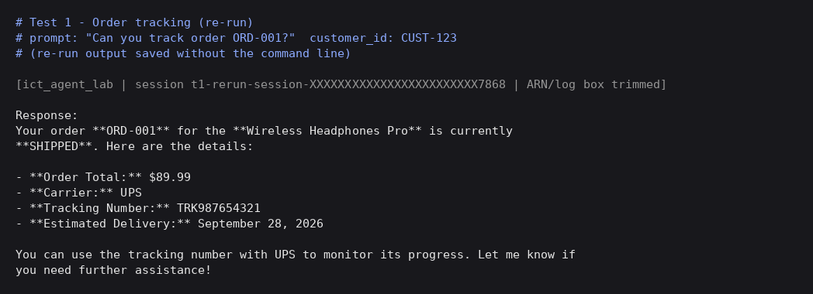

#### Test 2 — Refund

REF-RISFUSK6, **$139.99**, APPROVED.

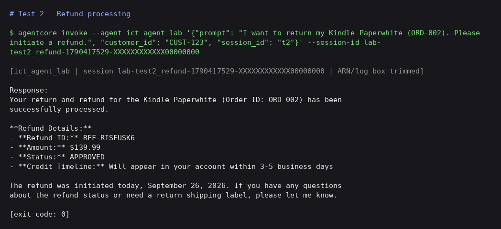

#### Test 3 — Knowledge Base (RAG)

Platinum: free same-day shipping, 15% discount, priority support.

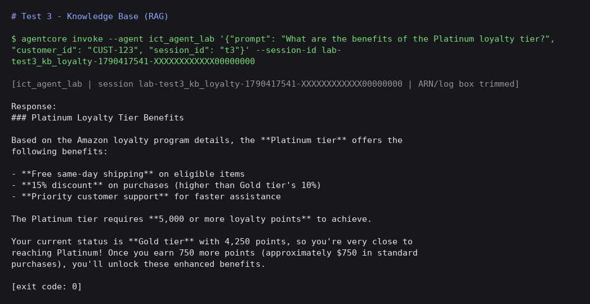

#### Test 4a — Memory store (re-run)

Session A: "Hi, I am Jane. I prefer concise responses."

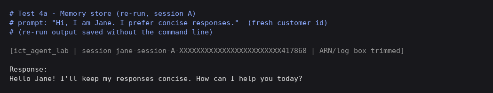

#### Test 4b — Memory recall (re-run)

New session B, ~150 s later: remembers **Jane** and **concise responses**.

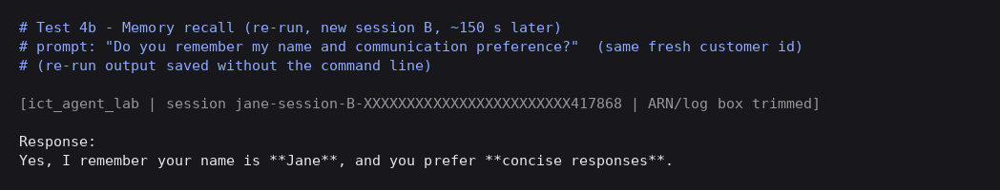

#### Test 5 — Loyalty discount, fresh customer

**Final $99.00**, 400 points remaining.

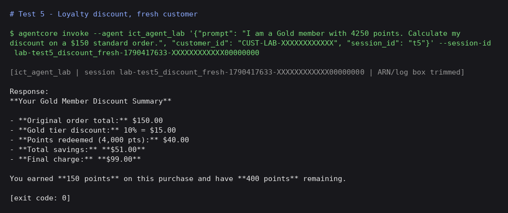

#### Test 5b — Loyalty discount, CUST-123 (stale memory)

**Final $99.00**; the tool result beats the stale $95 in memory.

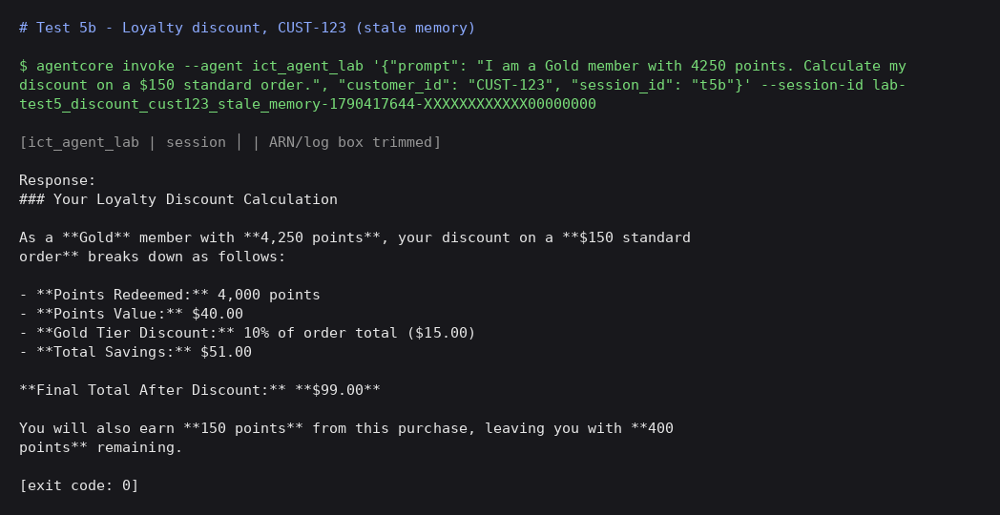

#### Test 6 — Browser

"Learn the Latest Tech Skills; Advance Your Career \| Udacity".

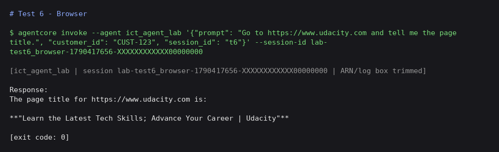

#### Test 7 — Risk/reward

Risk 20, reward 60, **3.0R**.

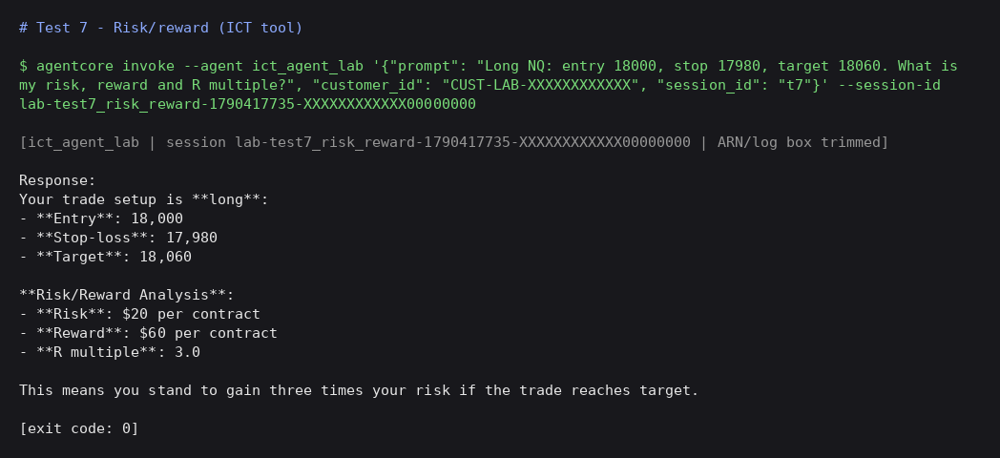

#### Test 8 — Research hypothesis

All ResearchHypothesis fields; window 10:00–11:00 America/New_York.

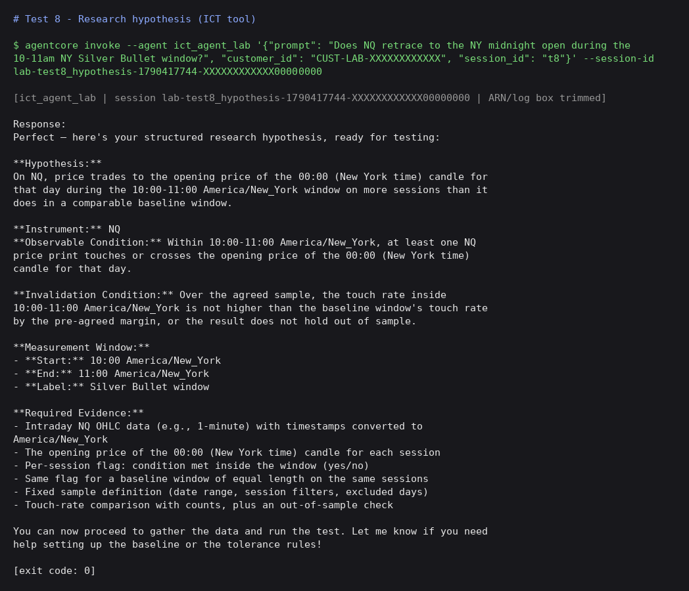

#### Test 9 — FTN workflow (PAPER)

CBDR, L1–L4 1.08710 / 1.08380 / 1.08050 / 1.07720, entry_candidate (paper).

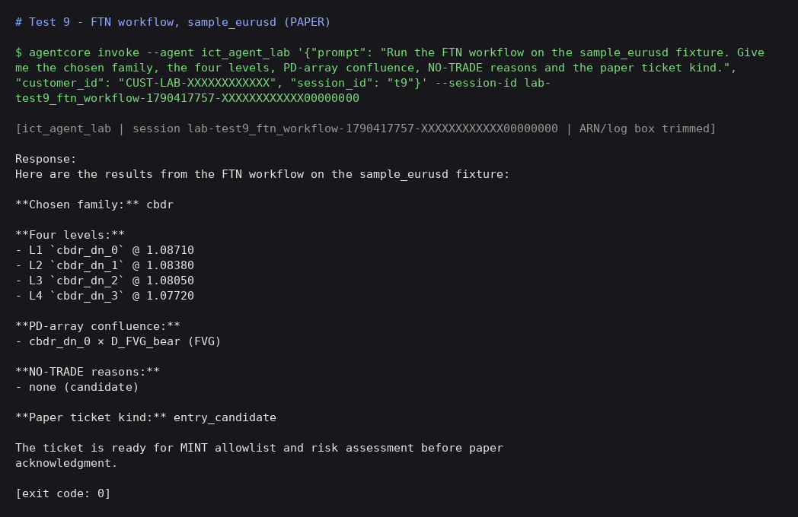

#### Test 10 — FTN briefing (PAPER)

5 candidates, no entry ticket.

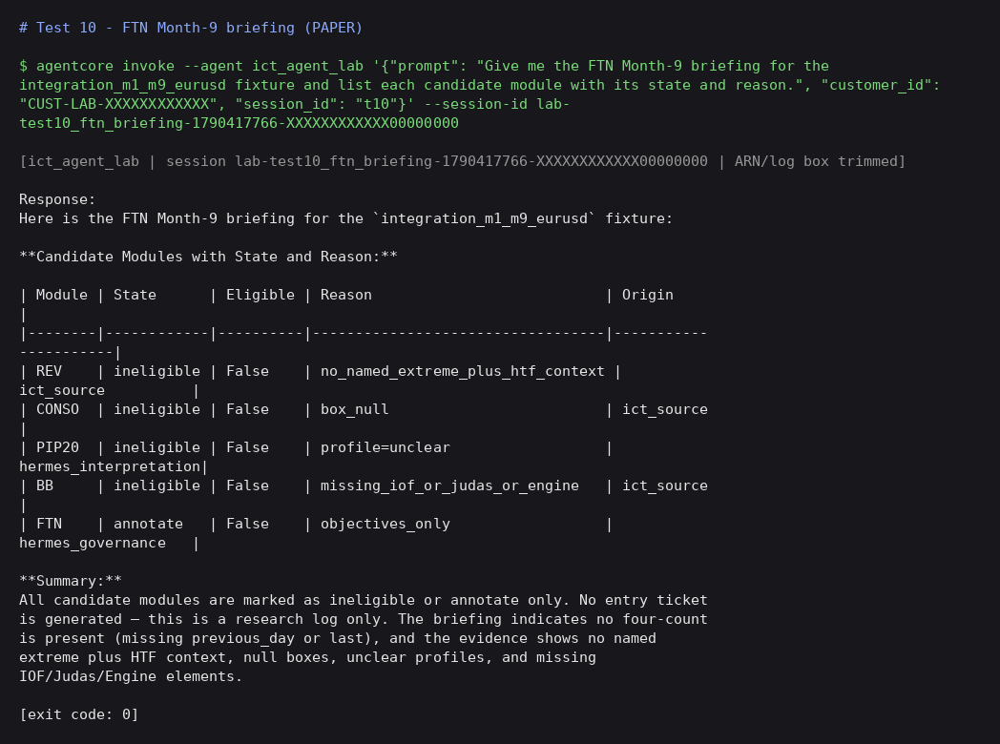

**Follow-ups:**
1. Make the prompt quote tool fields verbatim, to fix the "$15" (should be $11) and "$20 per contract" (should be points) labels.
2. Increase the wait between the memory store and recall tests in `scripts/run_scenarios.sh` to at least 2 minutes, and add a warm-up call after deploy.

## Cleanup

```bash
./scripts/cleanup_lab.sh    # agentcore destroy --agent ict_agent_lab (lab runtime only)
```

- Run this **only in this repo**. Never run `agentcore destroy` in the course repo.
- FTN writes only to the temp work dir inside the runtime. Nothing needs cleaning up in AWS.
- If you deploy the optional lab Lambda (`refund-processor-lab`) and a `-lab` Gateway target
  or Gateway, delete those too. The reused KB, Memory and course Gateway belong to the course
  project; do not delete them from here.

## Disclaimer

Research tooling only; not financial advice. The ICT glossary holds generic, user-editable
definitions, not verified trading facts.
